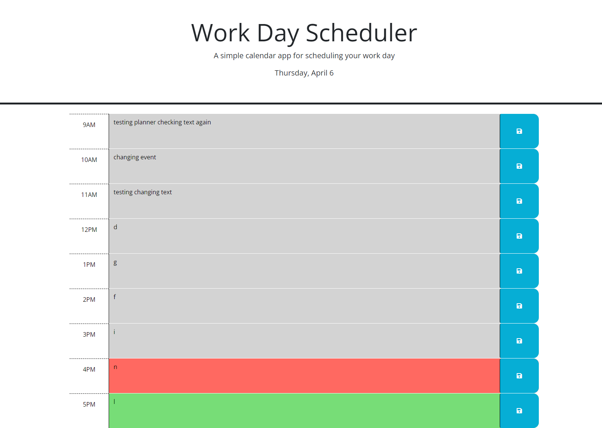

# Work-day-scheduler
## Description

This project provides a website schedule a day of work. The user will be able to track their tasks for a typical work day of 9 to 5. There are some features to save events,easily tell what day it is. It also provides color to track which events have happend, are currently happening, and are in the future.

## Installation
N/A

## Usage
check out the deployed website here!: https://ian-danas.github.io/Work-day-scheduler/

To use this website the user can start by seeing the current day at the top of the screen under the header which will show todays current date. The user can then click on any time block and enter text for the events that they want to add to the planner. Once they have added the events they will need to hit the save button for that time block in order to save the event they have just added. The website utilizes local storage so when the page is refreshed or reloaded all saved data will be displayed in its time slot. The user can also track events by noting the time of the block. If the block is grey that means the event is in the past of the current hour, Red means it is during the current hour, and green means its in the future of the current hour. 

## Credits
NA

## License
N/A